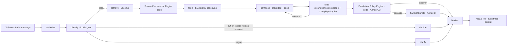

# InsightDesk — Self-Serve Customer Support with Safe Escalation

**HCLTech Future Ready AI Engineer Hackathon · Use Case 2** · Team **Overfitting Squad**

An agentic support assistant for the fictional SaaS product **CloudFlow**. For each
customer message it classifies intent, retrieves **grounded** help content, runs
**deterministic tools** for account facts, composes a **cited** answer, **critiques its
own draft**, and then **either answers or hands off to a human** with a complete context
bundle. It knows when it can answer safely and when it must escalate.

---

## Core design principle

> **LLMs produce structured signals. Deterministic code makes policy decisions. Tools produce facts.**

- **LLM** → intent classification, draft answer, (optional) critic scores — all Pydantic-validated.
- **Code** → Source Precedence Engine (Annex A.1/A.2), Escalation Policy Engine (Annex A.3),
  PII redaction, authorisation, policy-risk backstop.
- **Tools over SQLite** → every account / usage / invoice / refund / platform fact.

The **answer-or-escalate decision is code** applying the Escalation Policy to the critic's
scores (R5) — *not* the model. That single split is what makes the system auditable, safe,
and resistant to prompt injection.

## Architecture



**Capability levels reached (9.3):** 1 FAQ bot → 2 Grounded support → 3 Context-aware
(versions/deprecations/docs-over-tickets) → 4 Tool-using → 5 Self-critiquing + policy-driven
escalation → 6 Specialist nodes coordinated by a LangGraph orchestrator → 7 Evaluation,
observability, PII protection, guardrails, cost/latency, auditability.

## Technology stack (mandated)

| Layer | Choice | Note |
|---|---|---|
| UI | Streamlit | `ui/streamlit_app.py` |
| API | FastAPI + Uvicorn + Pydantic v2 | implements the Section 6 contract |
| Orchestration | LangGraph | `app/graph/` |
| Vector store | ChromaDB (persisted) | **1.5.x** — prebuilt wheels, native HNSW, no C++ compiler |
| Structured data | SQLite | Annex C schema |
| Embeddings | `all-MiniLM-L6-v2` | served via Chroma's bundled **ONNX** (no torch); `EMBEDDINGS=sentence-transformers` switches to the library form |
| LLM | **Ollama** `qwen2.5:3b-instruct` (local) | cloud is a disclosed fallback (`LLM_PROVIDER=cloud`); **`mock` runs the whole system with no model** |
| Packaging | Docker + docker compose | Ollama on host |

**LLM choice:** `qwen2.5:3b-instruct` (not 7-8B) — on CPU a 7B model runs 20-40s/request;
the 3B answers in ~10s and is reliable at JSON classification. Grounding/precedence/escalation
are code, so the model only adds fluency. See [`eval/report.md`](eval/report.md).

## Quick start

### Option A — local (fastest; what we used)
```bash
py -m venv .venv
./.venv/Scripts/python.exe -m pip install -r requirements.txt    # Windows
# source .venv/bin/activate && pip install -r requirements.txt   # macOS/Linux
cp .env.example .env            # defaults: LLM_PROVIDER=mock (works with NO model)

python scripts/bootstrap.py --reset        # build KB + accounts + index (one command)
uvicorn app.main:app                        # API at http://localhost:8000
streamlit run ui/streamlit_app.py           # UI at http://localhost:8501
```
To use the local model instead of mock: install Ollama, `ollama pull qwen2.5:3b-instruct`,
then set `LLM_PROVIDER=ollama` in `.env`.

### Option B — Docker
```bash
# Ollama runs on the host:  ollama pull qwen2.5:3b-instruct
docker compose up        # API :8000, UI :8501; API self-seeds on first start
```

## API (Section 6 contract)

| Endpoint | Purpose |
|---|---|
| `POST /support` | Handle a customer message (header `X-Account-Id`) |
| `POST /ingest` | Add an article/ticket while running (indexed immediately) |
| `GET /health` | Readiness of API, SQLite, vector store, LLM |
| `GET /conversations/{id}` | Conversation history + routes |
| `GET /handoffs/{id}` | Handoff bundle |
| `GET /audit/{trace_id}` | Full audit record for one response |
| `GET /sources` | Source Register |

### Sample curl
```bash
# a grounded, cited how-to
curl -s localhost:8000/support -H "X-Account-Id: A1001" -H "Content-Type: application/json" \
  -d '{"message":"How do I export my workflow run history?","as_of_date":"2026-10-06"}'

# a tool-grounded account answer (over the rate limit)
curl -s localhost:8000/support -H "X-Account-Id: A1003" -H "Content-Type: application/json" \
  -d '{"message":"Why are my API calls failing with 429 errors?"}'

# an escalation with a handoff bundle
curl -s localhost:8000/support -H "X-Account-Id: A1005" -H "Content-Type: application/json" \
  -d '{"message":"Third time writing! You charged me twice. Get me a manager!"}'

# live ingest (judges: add unseen content)
curl -s localhost:8000/ingest \
  -F 'metadata={"source_id":"KB-NEW-001","doc_type":"article","title":"New feature","authority_level":1,"product_versions":"4.x","last_updated":"2026-10-06","synthetic":"Y"}' \
  -F 'content=# New feature\n\n## Steps\nOpen Settings and enable it.'

# load judge test accounts (Annex C CSVs)
python scripts/load_accounts.py --dir synthetic/test_accounts/
```

## Data & knowledge base

- **34 articles** (incl. 4 policy + 1 **future-dated deprecation** release note), **2 product
  versions** (3.x / 4.x) with differing steps, error-code tables.
- **25 resolved tickets** — 3 angry (require human) + 3 whose workaround is **outdated and
  contradicted** by current docs (precedence test cases).
- **30 synthetic accounts**, all plans × statuses, with every required edge case pinned to a
  known ID (at-limit A1002, one-over A1003, failed-payment A1004, duplicate-charge A1005,
  refund-window boundary A1006, suspended A1007, old-version A1008…). See
  [`synthetic/data_card.md`](synthetic/data_card.md).
- **Policy registry** (12 rules) — every value cited to a `KB-POL-*` article.
- Generation is **deterministic** (see data card) so version conflicts, deprecation dates and
  ticket-vs-doc contradictions are exactly controlled and testable.

## Evaluation (summary — full report in [`eval/report.md`](eval/report.md))

27-case labelled set. Primary config (live Ollama, deterministic critic):

| Outcome | Retrieval hit | Citation | Conflict | Escalation P/R | PII leaks | p50 / p95 |
|---|---|---|---|---|---|---|
| 96.3% | 100% | 99% | 100% | **100% / 100%** | **0** | 9.9s / 13.7s |

Config comparisons justify our choices with numbers: **deterministic critic vs LLM critic** →
escalation precision **100% vs 45.5%**, latency halved; critic threshold **0.6 > 0.75**;
top_k=3 already sufficient.

## Safety (R8–R10)

- **Authorisation** — account from `X-Account-Id` only; another account's data is `refused`.
- **PII/secrets** — detected and redacted in **responses, handoff bundles and logs** (eval: 0 leaks).
  Password reset goes through a tool that **never** returns the token/link.
- **Prompt injection** — customer/ticket text is data, never instructions: user text is wrapped
  in a data boundary, **only trusted docs enter the prompt**, and a **code policy-risk backstop**
  converts any refund/credit/account-change promise into an escalation — even if the model is
  tricked into drafting one. (Demonstrated: a $5000-refund injection is caught and escalated.)

## Assumptions, limitations, known edge cases

- **Assumptions:** synthetic data is anchored to `as_of_date = 2026-10-06` (pass `as_of_date`
  to reproduce the refund-window boundary). Account identity is the header, never the message.
- **Limitations:** the 3B local model occasionally mislabels intent — mitigated by deterministic
  tool-selection and intent floors; `mock` mode is extractive (less fluent, maximally faithful).
  Docker compose is provided per spec but was authored on a machine without Docker, so it was not
  run locally (standard patterns; Ollama reached via `host.docker.internal`).
- **Known edge cases handled:** usage exactly at / one over a limit; duplicate charges; refund
  window boundary (day 14 eligible, day 15 not); suspended/past_due consistency; old product
  version; future-dated deprecation (announced, not yet effective); outdated ticket vs current doc.

## AI-usage disclosure & contributions
See [`AI_USAGE.md`](AI_USAGE.md) and [`CONTRIBUTIONS.md`](CONTRIBUTIONS.md).

## Repository layout
```
app/        FastAPI + LangGraph + core engines (precedence, escalation, pii) + tools + retrieval
kb/         generated knowledge base + source_register.csv
synthetic/  generators, validator, prompts, data card, test_accounts CSVs
scripts/    bootstrap, load_accounts, seed_policy, seed_sources, index_kb, make_samples
eval/       eval_set.jsonl, run_eval.py, make_report.py, report.md, results_*.json
ui/         Streamlit chat app
deliverables/ 3 sample audit records + 2 sample handoff bundles
```
